# 沪漫二厂 | Human-AI-Factory 2

<p align="center">
  <b>致敬上海美术电影制片厂</b><br>
  让中国动画的"精气神"焕发新生
</p>

---

AI 动漫创作平台的工作流引擎。Organize your projects by Drama and Episode, manage character/scene/prop assets, generate storyboards, and produce videos with multi-vendor AI integration.

## 产品系列

| 工厂 | 状态 | 描述 |
|:---:|:---:|---|
| [沪漫一厂](https://github.com/human-ai-factory/human-ai-factory-web) | 开发中 | 0成本短篇小说生成器 |
| 沪漫二厂 | 可用 | AI 动漫 Agent 工作流 |
| 沪漫三厂 | 规划中 | IP Generator |

## Features

- **剧集管理** - 以 Drama/Episode 结构组织项目
- **域对象工作台** - 管理角色、场景、道具资产
- **资产工作台** - AI 生成和管理角色/场景/道具资产
- **分镜生成** - 从剧本自动生成故事板
- **时间线编辑** - 多轨非线性视频编辑
- **多厂商 AI 集成** - 支持多种 AI 服务商:
  - 文本生成 (LLM)
  - 图像生成 (T2I)
  - 视频生成
  - 音频/TTS 合成

## 界面预览

### 登录与项目入口

<p align="center">
  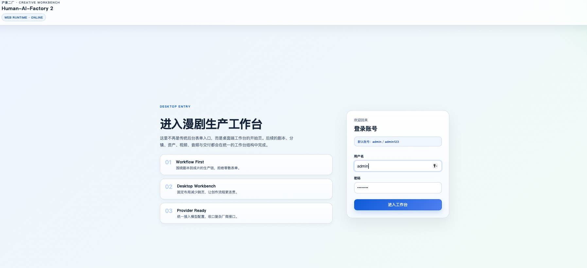
  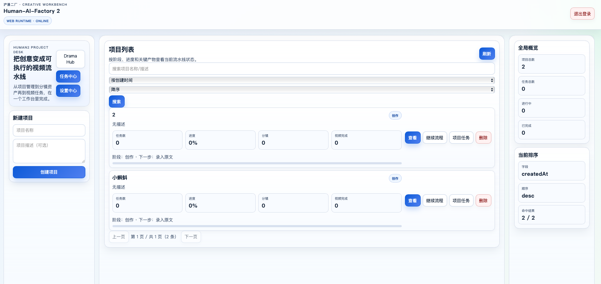
</p>

登录后直接进入项目目录，按 Drama / Episode 组织创作，不再把剧本、分镜、资产和生成任务拆散到不同后台页面。

### Drama 与工作台

<p align="center">
  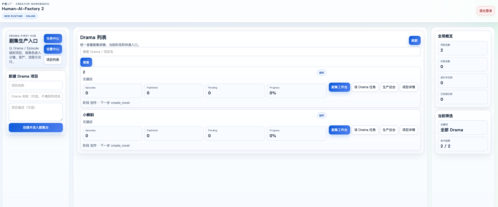
  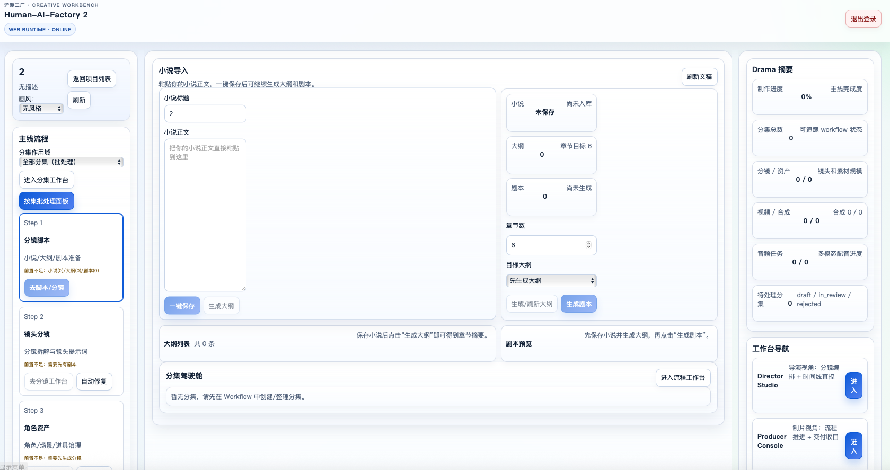
</p>

<p align="center">
  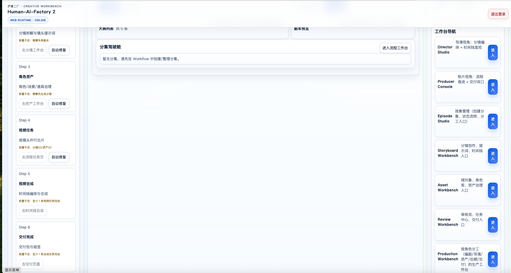
</p>

从 Drama Hub 进入后，可以继续下钻到剧本、分镜、资产、批处理和时间线工作台，覆盖从前期创作到生产交付的完整链路。

### 设置中心

<p align="center">
  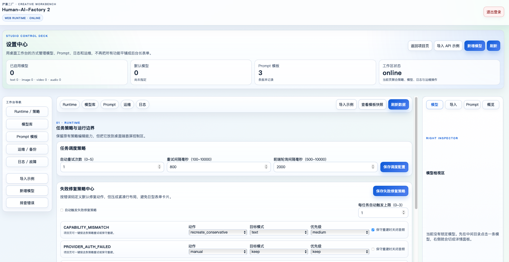
  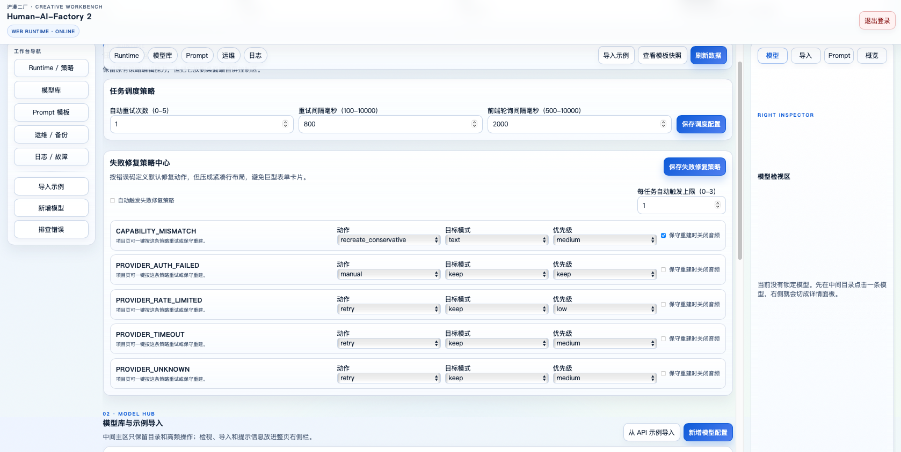
</p>

<p align="center">
  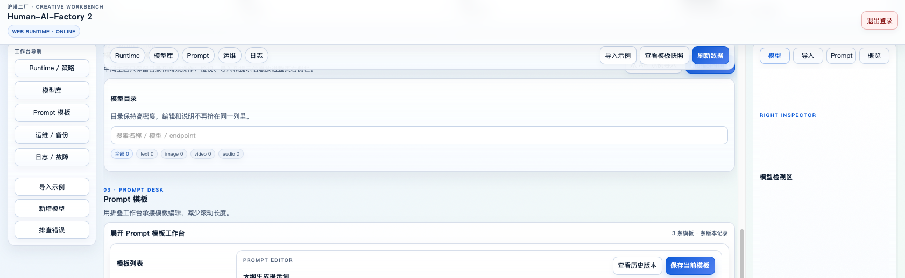
  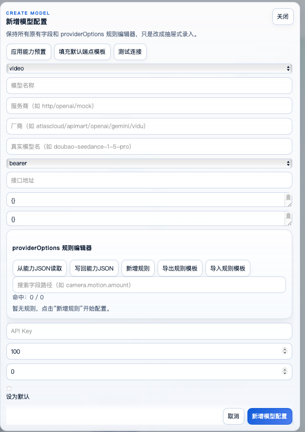
</p>

<p align="center">
  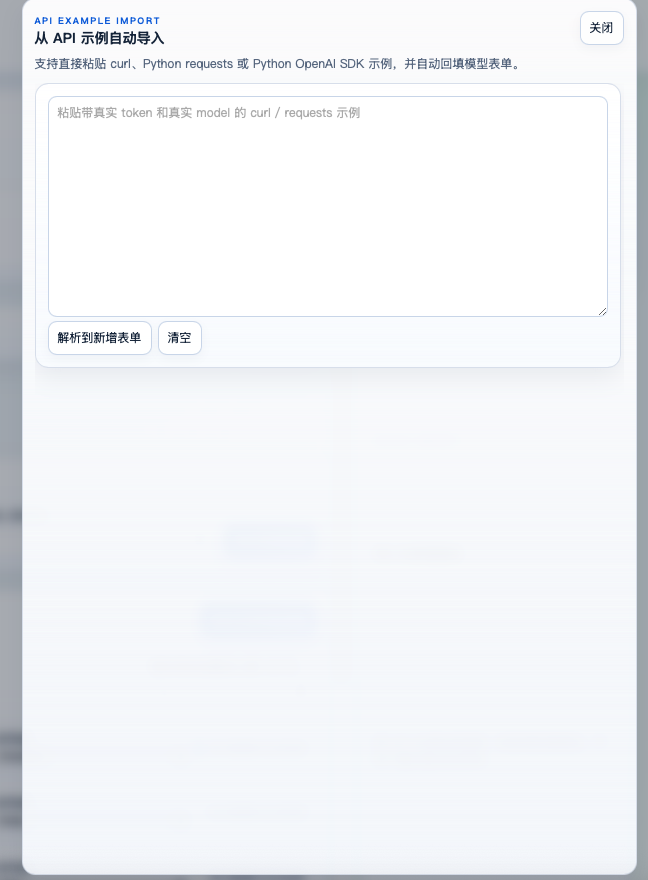
  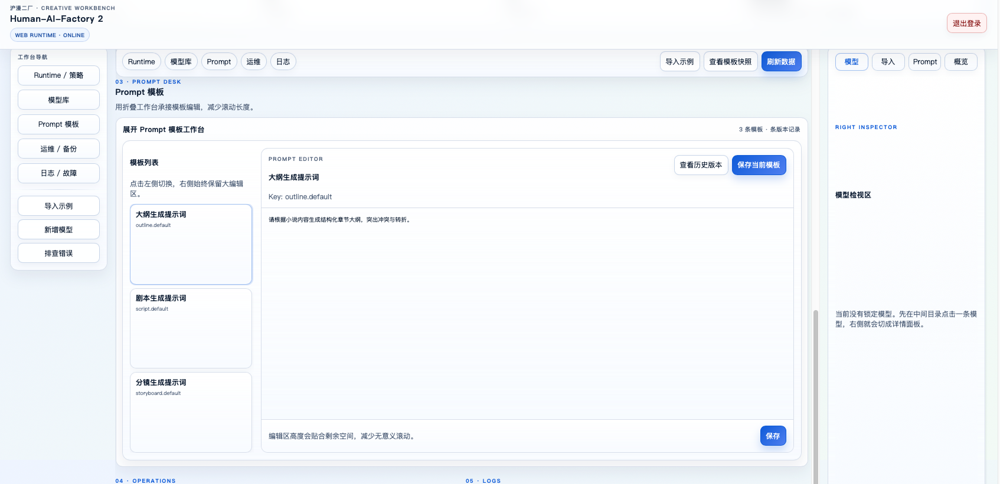
</p>

<p align="center">
  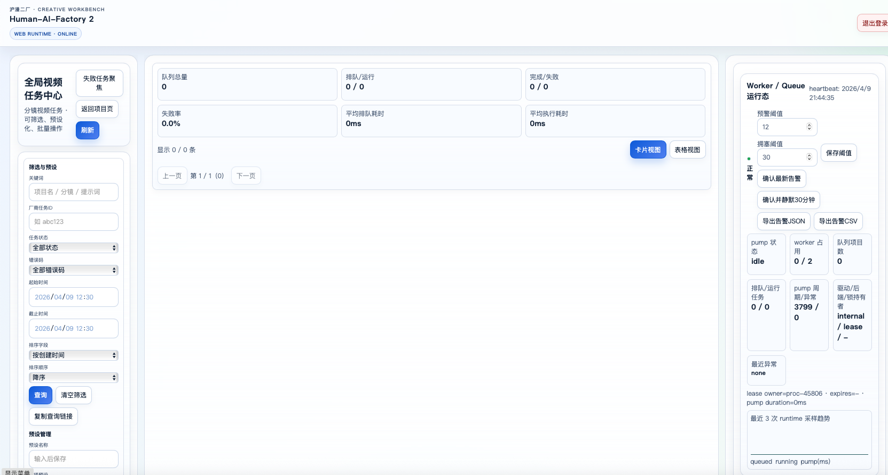
  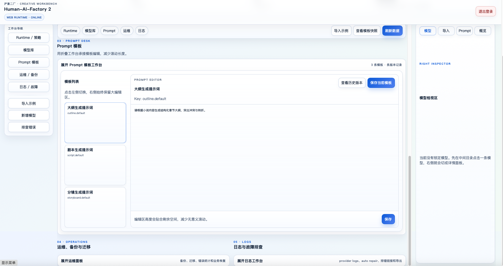
</p>

设置中心现在已经收敛成一个桌面式工作台：

- 模型库支持按 `text / image / video / audio` 选择能力类型
- 新增模型时优先选择厂商模板，再填写真实模型、API Key 和 endpoint
- 支持直接粘贴 `curl / requests / OpenAI SDK` 示例自动回填
- Runtime、Prompt、日志、备份与迁移都集中在同一页完成

## Tech Stack

- **Backend**: Node.js + Express + SQLite + TypeScript
- **Frontend**: Vue 3 + Vite + TypeScript
- **AI Providers**: HTTP-based abstraction layer supporting multiple vendors

## Quick Start

### 前置要求

- Node.js 18+
- yarn (推荐)
- ffmpeg (用于视频处理)

### 安装

```bash
# 克隆仓库
git clone https://github.com/human-ai-factory/human2-open-source.git
cd human2-open-source

# 安装后端依赖
cd backend
yarn install

# 安装前端依赖
cd ../frontend
yarn install
```

### 启动应用

```bash
# 终端 1: 启动后端 (端口 60000)
cd backend
yarn dev

# 终端 2: 启动前端 (端口 5173)
cd frontend
yarn dev
```

在浏览器打开 http://localhost:5173

### 默认登录

```
用户名: admin
密码: admin123
```

> **注意**: 生产环境请修改默认密码!

## AI 厂商配置

应用支持多种 AI 服务商，可以通过 **设置中心 → 新增模型** 快速接入：

1. **DashScope** (阿里云) - 文本、图像、视频、音频
2. **OpenAI** - 文本、图像、视频
3. **Runway** - 视频生成
4. **Kling** - 视频生成
5. **Minimax** - 文本、音频
6. **Vidu** - 视频生成
7. **Wan** (通义万相) - 图像生成
8. **ElevenLabs** - 音频/TTS

推荐配置流程:
1. 进入设置中心，点击“新增模型”
2. 先选择能力类型：`text / image / video / audio`
3. 再选择厂商模板：`OpenAI / Gemini / Vidu / Volcengine / Kling / ModelScope ...`
4. 填写真实模型名、API Key 和主 endpoint
5. 如需微调 `capabilities JSON`、多端点或 `providerOptions` 规则，可展开“高级设置”

如果你已经拿到厂商文档示例，也可以直接点击“导入 API 示例”，粘贴 `curl / Python requests / Python OpenAI SDK` 代码片段，系统会自动解析端点、模型、鉴权方式和能力预置。

## 项目结构

```
human2-open-source/
├── backend/           # Express API 服务
│   ├── src/
│   │   ├── config/        # 环境配置
│   │   ├── core/          # 核心类型
│   │   ├── db/            # SQLite 数据层
│   │   ├── modules/       # 功能模块
│   │   │   ├── auth/          # 认证
│   │   │   ├── projects/      # 项目与基础任务
│   │   │   ├── studio/        # 小说/大纲/剧本生成
│   │   │   ├── domain/        # Drama/Episode/域对象工作流
│   │   │   ├── pipeline/      # 分镜/资产/视频/音频/交付流水线
│   │   │   ├── tasks/         # 全局任务中心、告警、配额、SLO
│   │   │   ├── runtime/       # 队列运行时、统一告警、修复
│   │   │   ├── settings/      # 模型连接、Prompt、运维设置
│   │   │   ├── library/       # 资源库与去重/冲突处理
│   │   │   └── orchestration/ # 全链路编排入口
│   │   └── app.ts         # 入口文件
│   └── test/              # 单元测试
├── frontend/          # Vue 3 单页应用
│   ├── src/
│   │   ├── api/           # API 客户端
│   │   ├── components/    # 可复用组件
│   │   ├── features/      # 功能模块
│   │   │   ├── drama-hub/             # Drama 首页
│   │   │   ├── project-detail/        # 小说/大纲/剧本/分集驾驶舱
│   │   │   ├── storyboard-workbench/  # 分镜工作台
│   │   │   ├── asset-workbench/       # 资产工作台
│   │   │   ├── workflow-workbench/    # 批处理工作台
│   │   │   ├── timeline-editor/       # 时间线编辑器
│   │   │   ├── task-center/           # 任务中心与运维面板
│   │   │   └── settings/              # 设置中心
│   │   └── composables/   # Vue 组合式 API
│   └── test/              # 单元测试
├── desktop/           # Electron 桌面壳、本地媒体桥接、离线队列
├── data/              # 默认数据目录
├── docker-compose.yml # Docker 部署
└── Dockerfile         # 容器构建
```

## 后端 API 全图

- `POST /api/auth/login`
  登录并签发 JWT。
- `GET|POST|PATCH|DELETE /api/projects/*`
  项目列表、详情、项目级任务和 workflow 摘要。
- `GET|PUT|POST /api/studio/*`
  小说保存、小说生成、大纲生成、剧本生成。
- `GET|PUT|POST|PATCH|DELETE /api/domain/*`
  Drama、Episode、Episode workflow、Domain Entity、应用策略、生命周期、审计。
- `GET|POST|PATCH|DELETE /api/pipeline/*`
  分镜规划/生成/重写、资产生成/修改、视频任务、音频任务、时间线、交付包、上传接口。
- `GET|POST /api/orchestration/*`
  一键触发完整生产链。
- `GET|POST|PATCH /api/tasks/*`
  全局视频任务、事件导出、批量重试/取消/自动修复、运行时健康、统一告警、SLO、配额和失败注入。
- `GET|POST|PATCH|DELETE /api/settings/*`
  模型连接、Provider 能力目录、Prompt 模板、运行时策略、运维审计、迁移/备份。
- `GET|POST|PATCH|DELETE /api/library/*`
  资源库导入、建资产、冲突检测、去重与撤销。
- `GET /api/dashboard/summary`
  首页摘要。
- `GET /api/health`
  健康检查与请求指标。

## 前端页面与 Composable 关系

- `DramaHub`
  入口页，负责 Drama 列表、新建项目、跳转到分集/任务/生产台。
- `ProjectDetail`
  承担小说、大纲、剧本和分集驾驶舱，是从创作进入生产的总控页。
- `Episode/Storyboard/Asset/Workflow Workbench`
  围绕单集或批处理推进 storyboard、asset、frame prompt、review 与 delivery。
- `TimelineEditor`
  依赖 `useTimeline*` 系列 composable，覆盖剪辑轨、辅助轨、关键帧、布局模板、桌面桥接和本地草稿。
- `TaskCenter`
  依赖 `useTaskCenter*` 系列 composable，聚合任务查询、运行时健康、统一告警、SLO、配额和失败注入。
- `Settings`
  依赖 `useSettings*` 系列 composable，管理模型连接、Provider 规则、日志和运维动作。
- `AppShell`
  所有工作台共享的顶层壳，桌面模式下接入 `useDesktopRuntime` 与 `useDesktopLocalMedia`。

## Docker 部署

```bash
# 构建并运行
docker compose up --build
```

容器内运行目录为 `/app/backend`，因此默认的 `DATA_FILE=data/app.db` 和 `STATIC_DIR=../frontend/dist` 可以直接复用开发环境配置。

## 开发

```bash
# 运行后端测试
cd backend
yarn test

# 运行前端测试
cd frontend
yarn test

# 类型检查
cd backend
yarn typecheck

cd frontend
yarn typecheck
```

## 相关链接

- [沪漫工厂官网](https://human-ai-factory.github.io)
- [沪漫一厂 (短篇小说生成器)](https://github.com/human-ai-factory/human-ai-factory-web)

---

<p align="center">
  <sub>© 2026 沪漫工厂 · Human-AI-Factory</sub>
</p>
